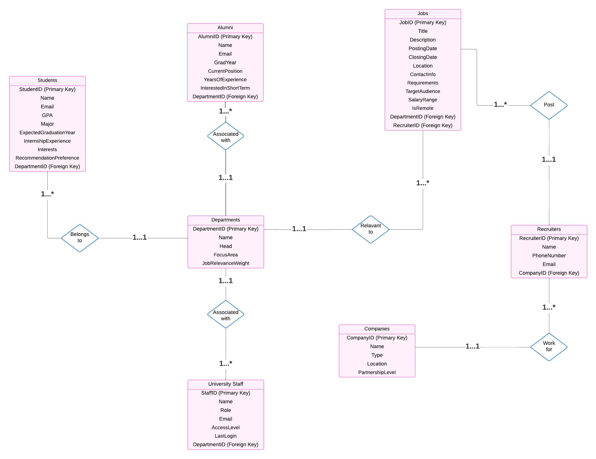
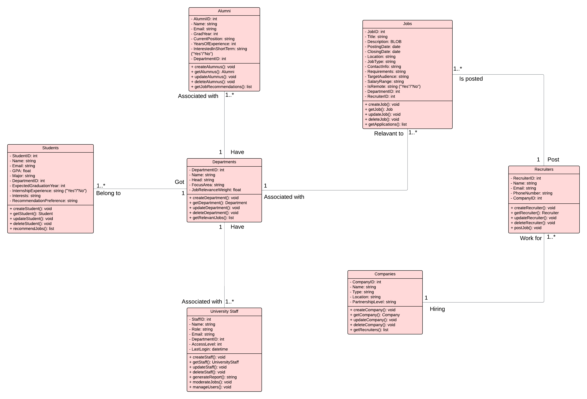

#  Alumni & Job Tracking System

##  Overview
The Alumni & Job Tracking System is designed to help universities and organizations manage information about students, alumni, and their career outcomes.  
It centralizes data about academic background, job opportunities, and alumni achievements, making it easier for departments and HR partners to analyze trends and support graduates.

##  Purpose
- Provide a structured database for storing and retrieving alumni and job data.  
- Allow HR teams to **identify the most suitable candidates** for specific job postings.  
- Enable administrators to **analyze employment trends** among graduates.  
- Offer students and alumni better access to career-related information.  

##  Features
- MySQL database with normalized schema.  
- 1,000+ rows of realistic test data generated with Python and Faker.  
- Optimized SQL queries, functions, triggers, and indexes (reducing search time by ~90%).  
- Role-based access and security policies for safe data handling.  

##  Demo & Documentation
This project comes with a **Report** and **Presentation** that walk through the system in detail:
- **Report.pdf**  Database schema, ER diagrams, queries, and evaluation.  
[View Project Report](./Report/Project%20Report.pdf)

- **Presentation.pptx** Visual overview of the system, workflow, and outcomes.  
[Presentation Report](./Presentation/Job%20Tracking%20System_ATH.pptx)

👉 Both are available in the [`docs/`](docs/) folder.

## System Diagram
### Entity-Relationship (ER) Diagram
  
Shows the main entities (Students, Alumni, Employers, Jobs) and how they are related.

---

### UML Diagram
  
Illustrates the system design with classes and their interactions.